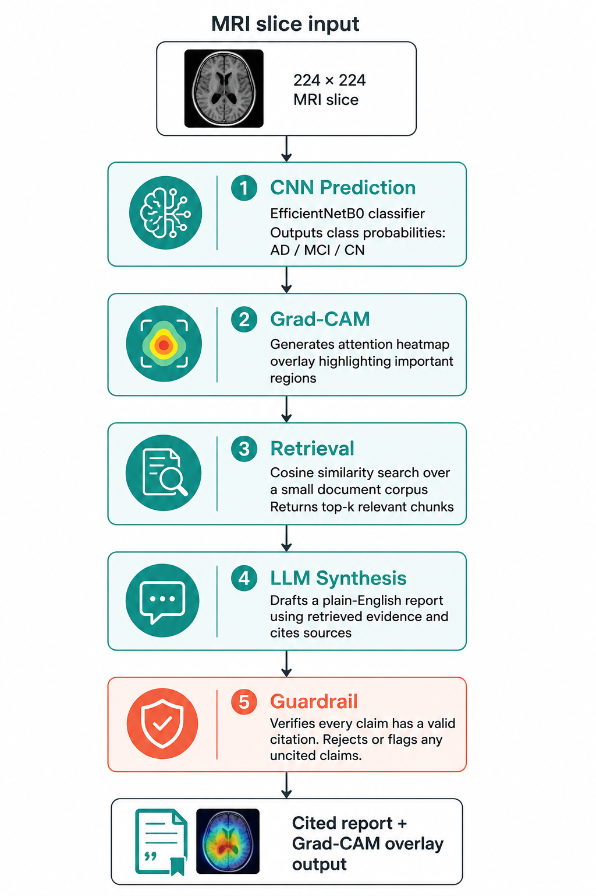
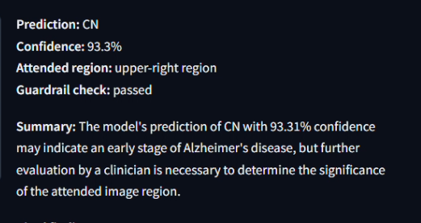
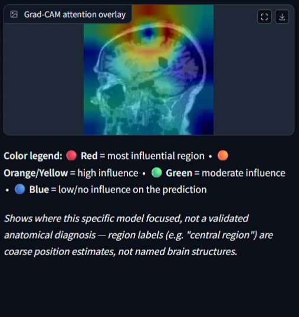
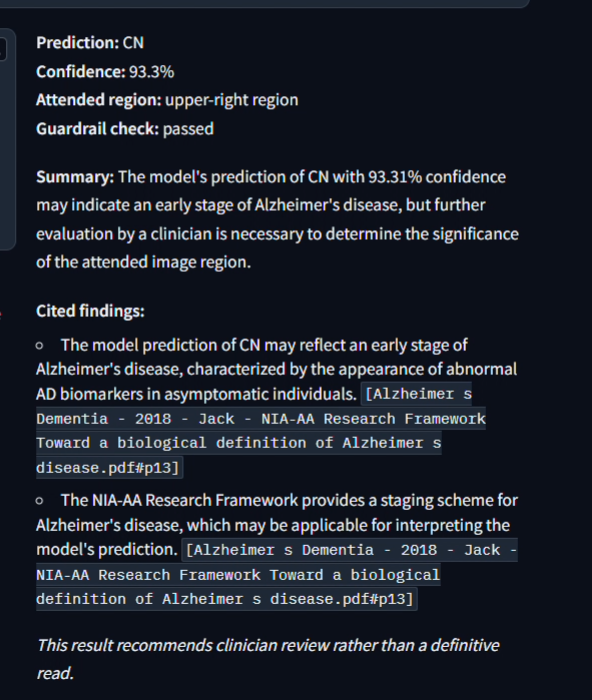
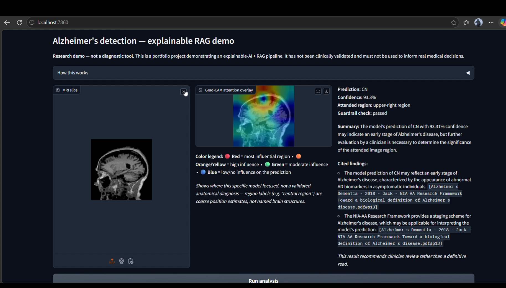

# Explainable Alzheimer's Disease Detection — CNN + Grad-CAM + RAG

An explainable, safety-aware AI system that classifies structural MRI
scans for signs of Alzheimer's disease, grounds its explanation in cited
literature using a retrieval-augmented LLM pipeline, and knows when *not*
to answer — detecting out-of-distribution inputs in the model's own
learned feature space rather than guessing on scans it was never trained
to interpret. Built to make a research-grade model's reasoning
inspectable and its limitations explicit, not just its output.

**Note:** this repository contains a project overview and demo only. The
full implementation is private, as this work extends a co-authored
research paper currently under review — happy to walk through the code
and methodology in more detail on request or in an interview.
---

## Demo

*(click the thumbnail to watch — unlisted video)*

---

## Architecture

## Screenshots

| Prediction output | Grad-CAM overlay |
|---|---|
|  |  |

| Cited report | Full UI |
|---|---|
|  |  |

---

## What it does

1. **CNN prediction** — classifies an MRI slice as AD (Alzheimer's Disease),
   CN (cognitively normal), or MCI (mild cognitive impairment), built on an
   EfficientNetB0 backbone with soft attention and genetic-algorithm-optimized
   architecture search, trained on ADNI structural MRI data.
2. **Grad-CAM explainability** — generates a visual attention heatmap
   showing which regions of the scan most influenced the model's
   prediction, using a custom two-stage split workaround to run Grad-CAM
   on a nested EfficientNet submodel in Keras.
3. **Retrieval** — the prediction and attended region are used to search a
   local corpus (the NIA-AA diagnostic criteria, this project's own paper,
   and six baseline architecture papers — VGG16, ResNet50, EfficientNet-B4,
   ViT, Vision Mamba, MedicalNet) for the most relevant supporting passages.
4. **LLM synthesis** — an LLM drafts a plain-English report, required to
   cite a specific retrieved passage for every clinical claim it makes.
5. **Guardrail verification** — every claim is programmatically checked for
   a valid citation before the report is shown to the user; uncited or
   unsupported claims are rejected rather than displayed.
## Reliability: knowing what it doesn't know

[#reliability-knowing-what-it-doesnt-know](#reliability-knowing-what-it-doesnt-know)

Most CNN classifiers will confidently produce a diagnosis for literally
any input — a softmax layer always outputs *some* distribution, even on
an image nothing like the training data. This system explicitly guards
against that failure mode rather than trusting the raw model output:

- **Out-of-distribution detection** — before any prediction is trusted,
the system computes the Mahalanobis distance of the incoming image in
the model's own 768-dimensional feature space (the layer immediately
before the final classification head) against a reference distribution
built from real training MRIs. Inputs that don't resemble anything the
model was trained on — non-MRI photos, scans in an unfamiliar format —
are rejected before classification, rather than silently misclassified.
- **Shrinkage covariance estimation** — the reference feature distribution
is estimated using Ledoit-Wolf shrinkage rather than a raw covariance
matrix, since the number of reference samples is close to the feature
dimensionality; a naive covariance estimate here is numerically unstable
and produces unreliable distances.
- **Confidence-aware output** — even for in-distribution scans, low-
confidence predictions are flagged distinctly rather than presented with
the same certainty as a high-confidence result, so a hard-to-classify
case is visibly uncertain instead of silently wrong.
- **Citation-enforced synthesis with retries** — the LLM report generation
step is wrapped with retry logic for both malformed JSON output and
empty/incomplete summaries, and the guardrail node rejects any claim
lacking a valid citation before the report reaches the user.
- **Short-circuited pipeline** — when an input is rejected as out-of-
distribution, the system skips Grad-CAM, retrieval, and LLM synthesis
entirely rather than running (and paying for) a full pipeline on an
input it already knows it can't handle.

**Known limitation:** the out-of-distribution check is scoped to the
specific preprocessing format (skull-stripped, axial-orientation ADNI
slices) used in training — a real brain MRI in a different orientation
or preprocessing pipeline may also be flagged as out-of-distribution,
since the model was never trained to interpret that format either. This
is a deliberate tradeoff: refusing an unfamiliar input is safer than
guessing on it.

## Results

- **95.14% classification accuracy** (AD / CN / MCI, 3-class)
- EfficientNetB0 backbone with soft attention and GA-optimized architecture
- Trained and evaluated on ADNI structural MRI data

## Tech stack

- **Modeling:** TensorFlow/Keras, EfficientNetB0, Grad-CAM
- **Orchestration:** LangGraph (StateGraph pipeline with retry logic),
  LangChain
-- **LLM:** Groq (openai/gpt-oss-120b)
- **Retrieval:** local vector store over an 8-document corpus, cosine
  similarity search
- **UI:** Gradio

## Research context

This project extends the CNN and methodology from a co-authored Alzheimer's
disease detection paper into a full explainable, LLM-integrated system. The
underlying paper is currently under review; this repo will be updated with
a link once it's published.
